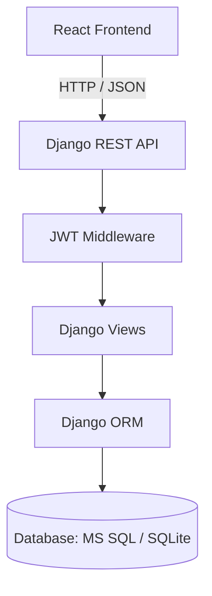
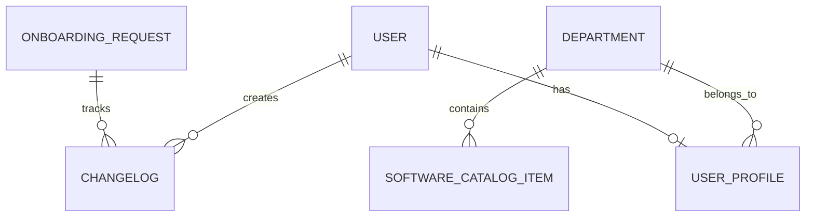
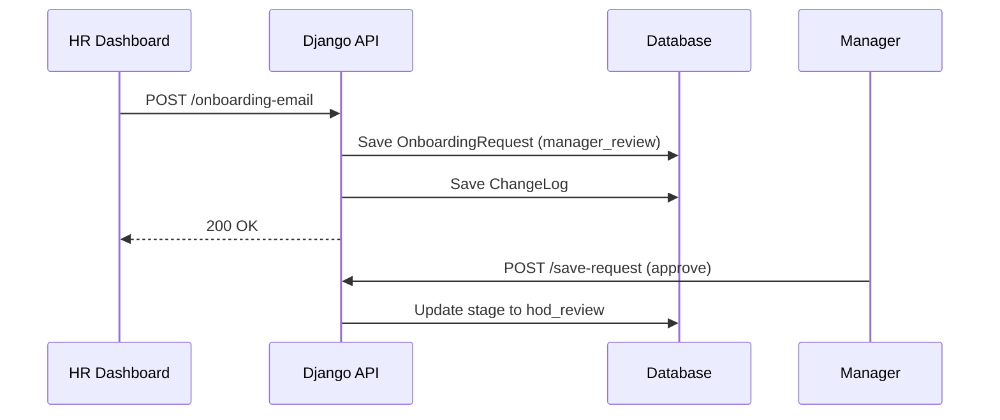

# Comprehensive Project Report: Onboarding Portal

## Phase 6 — Executive Summary

**Project Purpose:** The Onboarding Portal is a comprehensive, full-stack employee onboarding and provisioning system designed to seamlessly coordinate the onboarding process across multiple departments including HR, Line Managers, Heads of Department (HODs), Infrastructure Teams, and System Administrators.

**Overall Architecture:** Decoupled Client-Server SPA. React 19 Frontend communicating via RESTful JSON APIs to a Django 5.2 backend. Uses JWT for authentication.

**Major Modules:** 
- Request Management (HR, Manager, HOD, Infra)
- Catalog & Asset Management (Software, Hardware inventory)
- User Management & Self-Service
- Role-based Dashboards

**Strengths:**
- Strict role-based access control with detailed audit logs (ChangeLog).
- Robust input validation against gibberish and invalid formatting.
- Clear separation of concerns between frontend routing/state and backend validation.

**Weaknesses:**
- Default use of SQLite might lack concurrency scale if not explicitly deployed with MS SQL Server.
- Frontend uses `localStorage` without encryption, relying heavily on `JSON.parse` which could break if manually tampered with.

**Technical Debt:**
- Native `fetch` wrapper in `api.js` relies on modifying the global `window.fetch` object, which is an anti-pattern compared to Axios interceptors.
- Some complex views (like `save-request`) appear to handle a lot of state machine logic that could be extracted into a dedicated service layer.

**Security Posture:** Good. JWT validation is strictly enforced. Action roles are validated server-side. OTP protects profile updates and password resets. Input is sanitized and validated.
**Scalability Assessment:** Moderate. Django is scalable, but the SQLite fallback isn't. Needs proper WSGI/ASGI and robust DB for scale.
**Maintainability Assessment:** High. Clear folder structure, modularized Django views, React components are separated.
**Overall Code Quality Rating:** 8/10. Well-documented, robust validation, clean structure, but some global overrides in JS and lack of comprehensive test suites bring it down slightly.

---

## 1. Project Overview

**Project Name:** Onboarding Portal
**Purpose:** Automate and track the employee onboarding workflow across departments.
**Problem it solves:** Eliminates paper trails and disjointed communications during the onboarding phase by providing a centralized system for tracking requests, assigning hardware, and managing required software.
**Target users:** HR personnel, Line Managers, Heads of Department, Infrastructure Admins & Executives, and newly onboarded Employees.
**Major features:** Role-based dashboards, OTP-based profile updates, workflow management, software/hardware inventory tracking, automated employee code generation, and audit logging.
**Technology stack:** React 19, Vite, Django 5.2, MS SQL Server / SQLite.

---

## 2. Repository Structure

```text
Onboarding-App/
├── client/
│   ├── src/
│   │   ├── components/       # Reusable UI components
│   │   ├── services/         # API fetch wrappers (api.js)
│   │   ├── AdminDashboard.jsx
│   │   ├── App.jsx           # App entry, routing, state
│   │   ├── HRDashboard.jsx
│   │   ├── HRForm.jsx
│   │   ├── Login.jsx
│   │   ├── constants.js      # Workflow stages, roles
│   │   └── utils.js          # Helpers, validations
│   ├── package.json
│   └── vite.config.js
├── server/
│   ├── onboarding/           # Django App
│   │   ├── views/            # Modular views (auth, common, requests, etc.)
│   │   ├── models.py         # DB models
│   │   ├── urls.py           # API routing
│   │   └── tests.py
│   ├── onboarding_backend/   # Django Settings
│   ├── manage.py
│   └── requirements.txt
├── README.md
└── TECHNICAL_DOCS.md
```
**Important files:** `server/onboarding/models.py` (Database schema), `client/src/App.jsx` (Frontend routing), `server/onboarding/views/` (API Logic).

---

## 3. Technology Stack

**Frontend:**
- Framework: React 19 via Vite
- State management: React Hooks (useState, useEffect)
- Routing: Client-side hash-based routing built manually in App.jsx
- Styling: Vanilla CSS

**Backend:**
- Framework: Django 5.2
- Language: Python 3.10+
- ORM: Django ORM
- Authentication: Custom JWT via simplejwt
- Database engine: MS SQL Server (via mssql-django) or SQLite as fallback.

**Developer Tools:**
- Package managers: npm, pip
- Linter: ESLint

---

## 4. Architecture

High-level architecture is a decoupled Single Page Application (SPA).
The client uses Hash Routing to determine views. When making requests, `services/api.js` intercepts global `fetch` to append JWT tokens from `localStorage`.
The server is a REST JSON API. It uses `@require_jwt` to validate tokens statelessly and inject the `request.user` into views.



---

## 5. Complete Feature Inventory

| Feature Name | Description | Roles | Files Involved |
|---|---|---|---|
| **Role-based Auth** | JWT login and protected routes | All | `auth.py`, `App.jsx`, `api.js` |
| **Request Submission** | Submitting a new onboarding case | HR | `HRForm.jsx`, `onboarding.py` |
| **Workflow State Machine** | Transitions from Manager -> HOD -> Infra -> Approved | Manager, HOD, Infra | `RequestDetailPanel.jsx`, `requests.py` |
| **Software Catalog** | Managing pre-installed/employee software | Admin | `AdminDashboard.jsx`, `common.py` |
| **Asset Management** | Tracking Laptops (RAM, Storage, GPU) | Admin, Infra | `AdminDashboard.jsx`, `requests.py` |
| **OTP Self-Service** | Update profile via OTP verification | Employee | `users.py`, `App.jsx` |
| **Change Logs** | Audit trails for all request actions | All | `requests.py`, `models.py` |
| **Archive/Restore** | Soft delete of requests | Admin | `requests.py` |

---

## 6. Authentication & Authorization

- **Login Flow:** User posts email/password to `/api/login`. Backend verifies against Django User model and generates a JWT. Token is stored in `localStorage`.
- **Password Reset:** OTP is generated and emailed. Checked via `/api/verify-otp`.
- **JWT:** Used for all protected routes via `@require_jwt` decorator.
- **RBAC:** Roles are `Admin`, `Manager`, `HOD`, `Employee`. Frontend blocks views based on role (`getAllowedPagesForUser`). Backend explicitly checks roles in views before performing actions.

---

## 7. Database Documentation

**Tables:**
1. `Department`: `id`, `name` (unique).
2. `UserProfile`: One-to-one with User. `role`, `department_id`, `phone_number`, `employee_code`.
3. `SoftwareCatalogItem`: `name`, `category`, `department_id`, `is_active`.
4. `AssetInventory`: `asset_code`, `laptop_model`, `laptop_processor`, `laptop_ram`, `laptop_storage`, `laptop_gpu`, `is_assigned`.
5. `OnboardingRequest`: Tracks full workflow. Dozens of fields including `request_code`, `stage`, `employee_name`, `pre_installed_software`, `manager_software`, `asset_code`.
6. `ChangeLog`: Audit trail. `actor`, `action_type`, `description`, `timestamp`.
7. `PasswordResetOTP`: `email`, `otp`, `is_verified`.



---

## 8. API Documentation

*Partial Endpoint List (Refer to TECHNICAL_DOCS.md for full list):*
- `POST /api/login`: Accepts `email`, `password`. Returns `{token, user}`.
- `POST /api/onboarding-email`: HR creates request. Accepts `employee_name`, `personal_email`, `department`, etc.
- `POST /api/save-request`: Updates state machine. Accepts `request_code`, `action` (approve, send_back, stop), `comments`.
- `GET /api/requests`: Returns filtered list of requests.
- `GET /api/changelogs`: Returns audit trail logs.
- `POST /api/finalize-onboarding`: Allocates final employee code and creates Employee user.

---

## 9. Frontend Documentation

- **Routing:** Handled manually in `App.jsx` checking `window.location.hash`.
- **State:** React Context / useState for global `user`, `token`, `requests`.
- **API calls:** Centralized in `services/api.js`. Overrides global `fetch` to add `Authorization: Bearer <token>`.
- **Components:** `AdminDashboard`, `HRDashboard`, `HRForm`, `RequestDetailPanel`.

---

## 10. Backend Documentation

- **Controllers/Views:** Modularized in `server/onboarding/views/`. Separated into `auth.py`, `users.py`, `requests.py`, `common.py`, `onboarding.py`.
- **Models:** Defined in `models.py`. Extensive use of custom validators (`validate_gibberish`, `validate_phone_number`) triggered in `.clean()` methods.

---

## 11. Data Flow



---

## 12. Security Analysis

- **Authentication:** Custom JWT generation and verification.
- **Authorization:** Handled per-view based on injected `request.user`.
- **Input Validation:** Strict gibberish detection algorithm in Django models.
- **Vulnerabilities:** `localStorage` is vulnerable to XSS if malicious scripts are injected (though React escapes variables). Use of global `fetch` override is risky if other third-party libraries use `fetch`.

---

## 13. Configuration

- `DJANGO_SECRET_KEY`: Used for JWT and sessions.
- `GMAIL_SENDER` / `GMAIL_APP_PASSWORD`: SMTP integration for OTP.
- `VITE_API_URL`: Frontend pointer to backend API.
- `DB_NAME`, `DB_HOST`: For MS SQL configuration.

---

## 14. External Integrations

- **Email Provider:** SMTP via Gmail (`django.core.mail`). Used for OTP delivery and notification workflows.

---

## 15. Build & Deployment

- **Development:** `npm run dev` (Vite) and `python manage.py runserver` (Django).
- **Deployment:** Needs standard Django production setup (Gunicorn) and static file serving for React bundle.
- **Migrations:** `python manage.py migrate` populates schema and seeds initial data.

---

## 16. Testing

- Unit tests exist (`tests.py`) but coverage is not specified.
- Framework: Django `TestCase`.
- Missing tests: Comprehensive E2E tests for the frontend (e.g., Cypress/Playwright).

---

## 17. Logging & Monitoring

- **Error handling:** Django default error handling.
- **Auditing:** `ChangeLog` table logs all business logic state transitions.
- **Alerts:** None currently implemented.

---

## 18. Performance

- **Database:** Standard indexing applied (`db_index=True` on frequently queried fields).
- **Code splitting:** Vite handles this inherently, though SPA is monolithic.
- **Improvement:** Implement pagination for `/api/requests` as data grows.

---

## 19. Known Issues

- Technical Debt: `localStorage` direct parsing without `try/catch` fallback could crash the frontend if tampered with.
- Using SQLite in production environments will bottleneck quickly.

---

## 20. Improvement Opportunities

1. **Security:** Move JWT storage from `localStorage` to `HttpOnly` secure cookies.
2. **Performance:** Implement pagination on the requests and changelogs API endpoints.
3. **Refactoring:** Remove the global `window.fetch` override in favor of a dedicated Axios instance.

---

## Phase 4 — Developer Guide

- **Local Setup:** Requires Node 18+ and Python 3.10+.
- **Backend Setup:** `python -m venv venv`, `pip install -r requirements.txt`, `python manage.py migrate`, `python manage.py runserver`.
- **Frontend Setup:** `npm install`, `npm run dev`.
- **Branching Strategy:** Not determinable from the available codebase. Use standard GitFlow.
- **Environment:** Use `.env` in both `client/` and `server/`.
